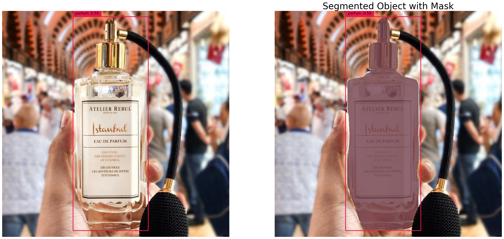

# COG Implementation of Background Remover 
GroundingDino, Segment Anything, Inpainting SDXL and Controlnet Canny

This is an implementation of a blend of technologies in a Cog model, it works on Mac (M1, M2, M3) and CUDA machines.

# Test it on Replicate
Go to replicate to test this endpoint [clicking here](https://replicate.com/alexgenovese/bg-remover)

# How it works 

1. Identify the object with Grounding Dino and Segment Anything help to create a mask 

2. Run the inference with a custom prompt

